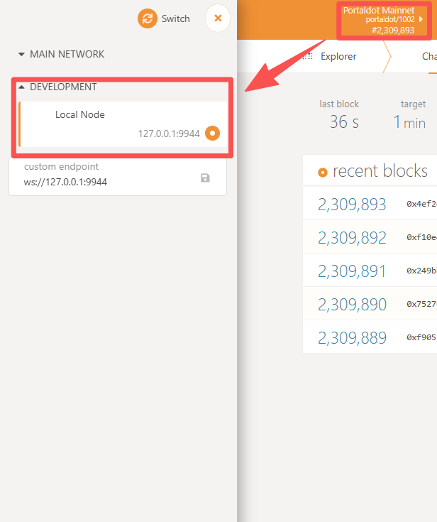

Local Development Network
==========================

.. toctree::
    :maxdepth: 4

You can easily start a local development network by next steps.

---------------------

**Download client**

Download the client refer to  :doc:`../chain-info`.

Taking the Ubuntu client as an example, we decompress the downloaded file ``portaldot-testnet-ubuntu.tar.gz``

and then execute the following commands.

.. code:: bash

    tar -cxvf portaldot-testnet-ubuntu.tar.gz
    cd portaldot-testnet-ubuntu
    chmod 755 portaldot_dev

**Run a local development node**

.. code:: bash

    portaldot_dev --dev --alice

**Connect to chain explorer**

Open an web browser (e.g., Chrome) and go to the `Portaldot explorer <https://www.portaldot.io/>`_.

Select the ``Local Node`` in the network options.

